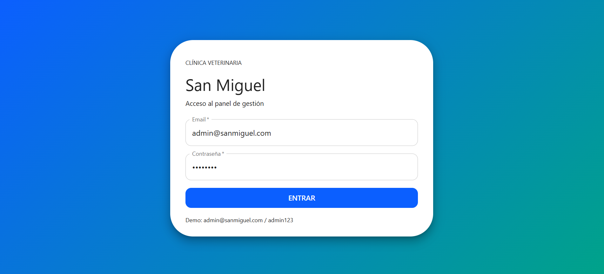
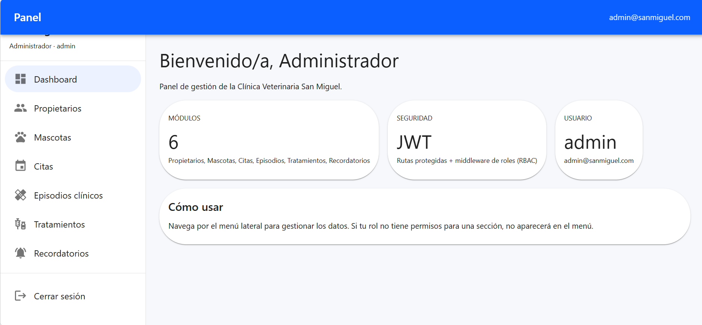
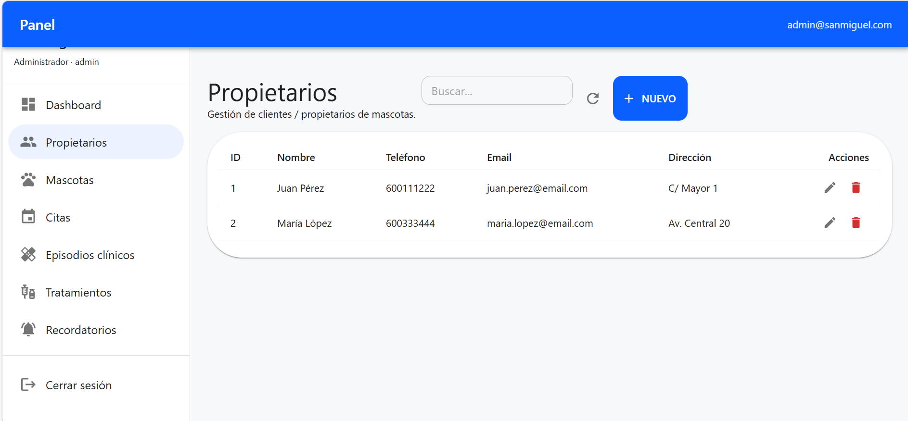
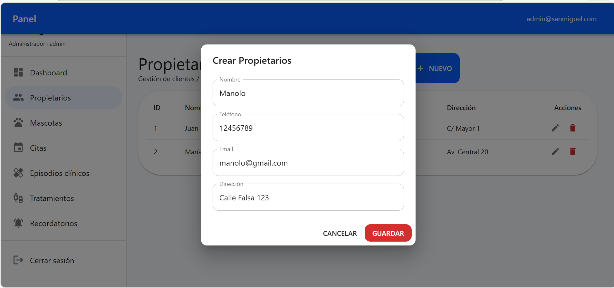
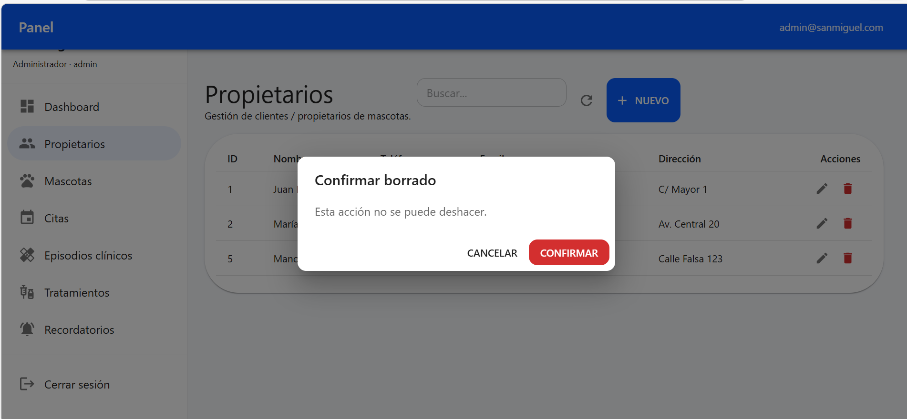
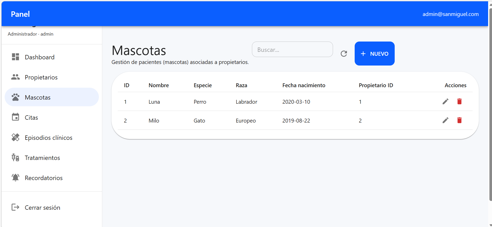
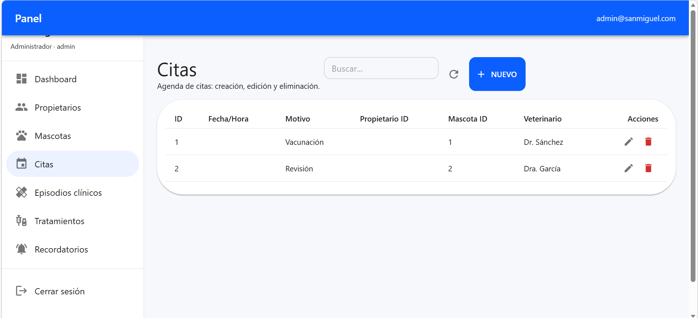
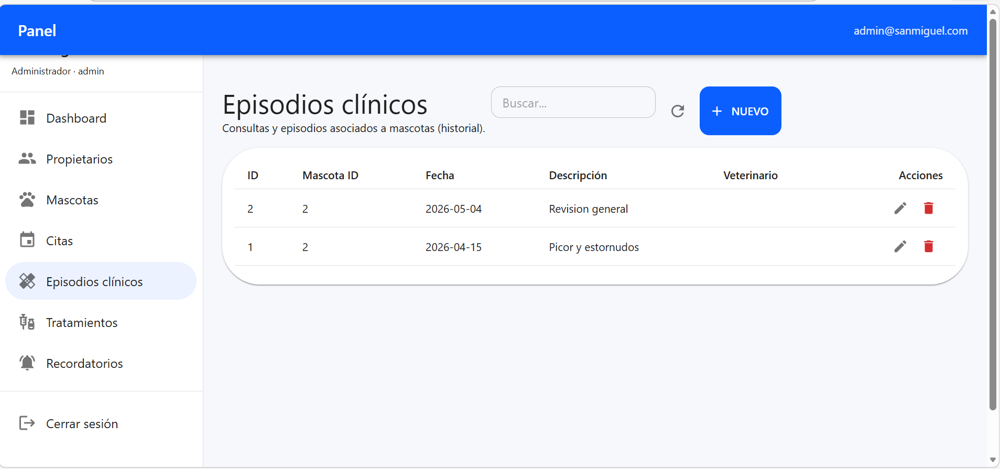
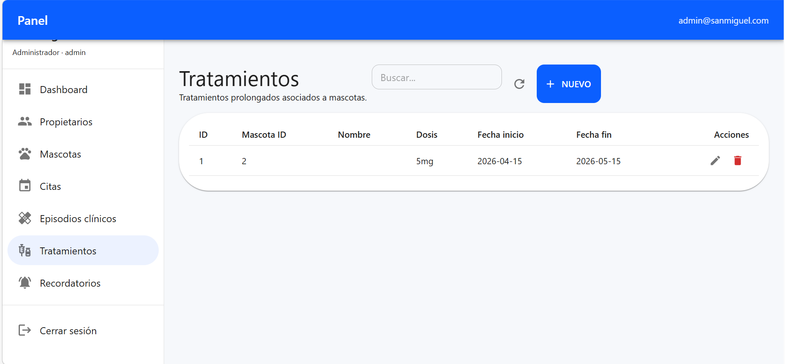
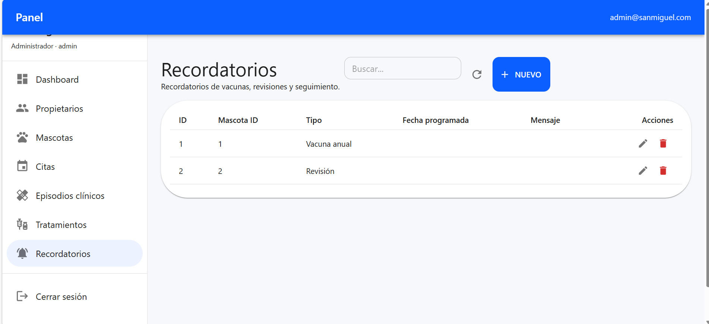

# Clínica Veterinaria San Miguel

Proyecto de digitalización y modernización de la gestión interna de la Clínica Veterinaria “San Miguel”.

## Descripción

La clínica actualmente gestiona citas, historiales clínicos y seguimientos mediante agendas en papel, hojas de cálculo y archivos físicos. Esto provoca errores, duplicidades, pérdida de tiempo y dificultades en el acceso a la información clínica.

Este proyecto propone e implementa una solución software centralizada para gestionar:

- propietarios
- mascotas
- citas
- historiales clínicos
- tratamientos
- seguimientos y recordatorios
- acceso por roles
- informes básicos

## Objetivos

- centralizar la información clínica y administrativa
- reducir errores y duplicidades
- facilitar el acceso rápido al historial de cada mascota
- mejorar el seguimiento de vacunaciones y tratamientos
- optimizar el tiempo del personal
- aumentar la trazabilidad y la seguridad de la información

## Alcance del MVP

La primera versión incluye:

- autenticación (login) con JWT
- middleware de autenticación (auth)
- middleware de autorización por rol (role)
- rutas protegidas por rol
- gestión de propietarios
- gestión de mascotas
- gestión de citas
- historial clínico básico
- tratamientos
- recordatorios
- API REST documentable
- tests unitarios e integración básicos

## Capturas de la interfaz (UI)

> Las imágenes del README se guardan en `docs/screenshots/`.  
> Si clonas el repo y no se ven, revisa que esos ficheros existan en tu rama.

### Login
Pantalla de acceso al panel interno. La autenticación se realiza contra la API y devuelve un **JWT**.
  


### Dashboard
Resumen inicial del panel: módulos disponibles y usuario autenticado (según rol).
  


### Propietarios (listado)
Gestión de clientes/propietarios: listado, búsqueda y acciones de edición/borrado.
  


### Propietarios (alta / edición)
Formulario modal para crear o editar un propietario.
  


### Propietarios (confirmación de borrado)
Diálogo de confirmación para evitar borrados accidentales.
  


### Mascotas
Gestión de pacientes (mascotas) asociadas a propietarios.
  


### Citas
Gestión de agenda: creación, edición y eliminación de citas.
  


### Episodios clínicos
Registro y consulta de episodios clínicos (historial). Visible para roles clínicos.
  


### Tratamientos
Gestión de tratamientos prolongados asociados a mascotas.
  


### Recordatorios
Seguimiento de vacunas, revisiones y recordatorios asociados a mascotas.
  


## Estructura del repositorio

```text
docs/         -> documentación funcional y técnica
database/     -> esquema y datos semilla
src/backend/  -> API backend en Node.js + Express
src/frontend/ -> frontend (React + Vite)
tests/        -> pruebas globales
```text

## Stack tecnológico

### Backend
- Node.js
- Express
- SQLite (por defecto en este repo, para facilidad de ejecución local)
- Jest
- Supertest

### Frontend
- React
- Vite
- React Router
- MUI (Material UI)
- Axios

### Calidad y despliegue
- Docker
- GitHub Actions
- ESLint

## Cómo ejecutar el backend

### 1. Entrar al backend (Windows CMD)
```bat
cd src\backend
```

### 2. Instalar dependencias
```bat
npm install
```

### 3. Configurar variables de entorno
Copiar `.env.example` a `.env` y ajustar valores.

Variables relevantes:
- `JWT_SECRET`: clave para firmar/verificar JWT
- `JWT_EXPIRES_IN` (opcional): expiración del token (por defecto `8h`)
- `DB_CLIENT`: `sqlite` (recomendado) o `pg`
- `SQLITE_FILE`: ruta al fichero SQLite (por defecto `./data/clinica.sqlite`)

### 4. Inicializar base de datos SQLite (una vez)
```bat
node scripts\sqlite-init.js
```

### 5. Ejecutar en desarrollo
```bat
npm run dev
```

Alternativa (desde la raíz del repo, en una sola línea):
```bat
cmd /c "cd /d src\backend && node scripts\sqlite-init.js && npm run dev"
```

## Cómo ejecutar el frontend

### 1. Entrar al frontend (Windows CMD)
```bat
cd src\frontend
```

### 2. Instalar dependencias
```bat
npm install
```

### 3. Ejecutar en desarrollo
```bat
npm run dev
```

Frontend por defecto:
- URL: `http://127.0.0.1:5173/`

> Nota CORS: el backend permite `http://localhost:5173` y `http://127.0.0.1:5173`.

## Roles y accesos (panel interno)

La aplicación está pensada para **uso interno** del personal de la clínica:

- **admin**: acceso total (administrativo + clínico).
- **veterinario**: módulos clínicos y operativos.
- **auxiliar**: lectura + registro básico (sin borrado).
- **administrativo**: gestión de agenda y datos administrativos (propietarios/mascotas/citas) **sin acceso a clínica**.

Reglas aplicadas en rutas:
- `propietarios`, `mascotas`, `citas`: **administrativo** puede **leer + crear + actualizar**.
- `mascotas/:id/historial`: **administrativo NO** (solo `admin|veterinario|auxiliar`).
- `episodios`, `tratamientos`, `recordatorios`: solo `admin|veterinario|auxiliar` (clínico) y escritura según endpoint.

## Base de datos

Por defecto se usa SQLite (fichero: `src/backend/data/clinica.sqlite`).

Los scripts SQL se encuentran en:

- SQLite: `database/schema.sqlite.sql` y `database/seed.sqlite.sql`
- PostgreSQL (alternativo): `database/schema.sql` y `database/seed.sql`

### Usuarios demo (roles) sin modificar el seed

El seed SQLite trae un único usuario admin. Para crear usuarios de prueba para los otros roles **sin tocar** `database/seed.sqlite.sql`, se incluye este script idempotente:

```bat
cd src\backend
node scripts\sqlite-add-demo-users.js
```

Credenciales demo:
- **ADMIN**: `admin@sanmiguel.com / admin123` (viene del seed)
- **VETERINARIO**: `vet@sanmiguel.com / vet123`
- **AUXILIAR**: `aux@sanmiguel.com / aux123`
- **ADMINISTRATIVO**: `admini@sanmiguel.com / admini123`

## Cómo probar (demo rápida)

### 1) Healthcheck
```bat
curl http://localhost:3001/health
```

### 2) Login (JWT)
```bat
curl -X POST http://localhost:3001/api/auth/login ^
  -H "Content-Type: application/json" ^
  -d "{\"email\":\"admin@sanmiguel.com\",\"password\":\"admin123\"}"
```

### 3) Endpoint protegido (ejemplo)
```bat
curl http://localhost:3001/api/propietarios ^
  -H "Authorization: Bearer TU_TOKEN_AQUI"
```

Comportamiento esperado:
- sin `Authorization` -> 401
- token válido + rol permitido -> 200
- token válido + rol no permitido -> 403

## Documentación

La documentación funcional y técnica está en la carpeta `docs/`.

## Estado del proyecto

En desarrollo.

## Autoría

Proyecto académico para análisis, diseño y desarrollo de una solución de gestión veterinaria.
